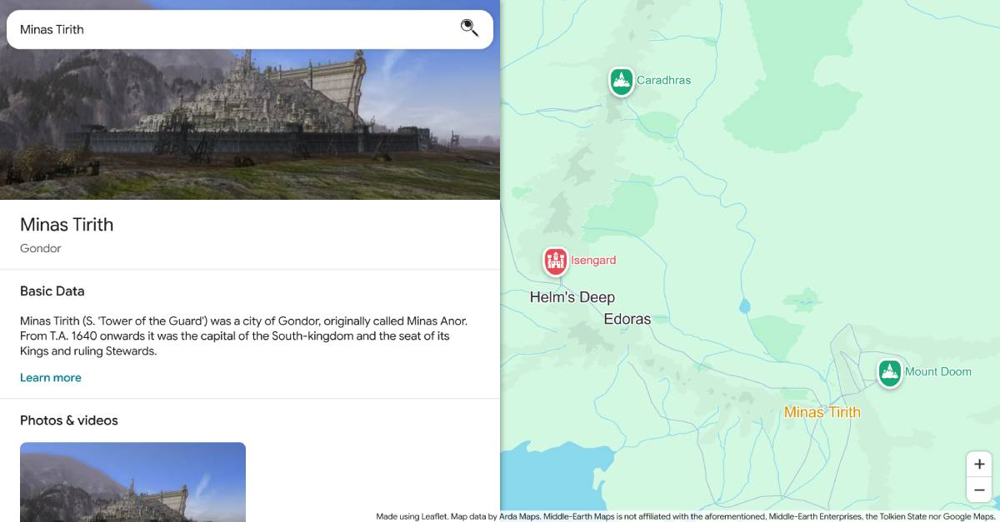

# Middle-Earth Maps

A Google Maps-inspired Middle-Earth interactive web app.

## Todo

- [ ] Fill images preferrably from depections of Middle-Earth in other media, such as Videogames.
- [ ] Add custom non-canonical data from games such as regions & places from the Mordor of the [Shadow of Mordor](https://en.wikipedia.org/wiki/Middle-earth:_Shadow_of_Mordor) series.

## Contribute

You can help by adding images of places to `public/images/places/`:

1. You need to create a subfolder with the place id (Check the [ids.txt](./public/ids.txt)).
2. Add a descriptive name to the image you attach.
3. Use underscores instead of spaces for the name.
4. Add a number prefix to the name, to control the order of which the images are shown.
5. Don't edit `public/db.json`, this file is generated using `bin/generatePlaceDatabase.js`. You can run the script, but I will run it for you if you do a PR.

Example: `public/images/places/DoorsOfDurin/2_LEGO_game_depiction.webp`.

Ideally all images will be screenshots from Middle-Earth official media such as videogames.

## Credits & Attributions

- Thanks to [kwoxer/Arda-Maps](https://github.com/kwoxer/Arda-Maps) for the base layer information.
- Thanks to [bburns/arda](https://github.com/bburns/arda) as was my inspiration and first option for the data source, however I ended up using the former.
- Thanks to [Tolkien Gateway](https://tolkiengateway.net/) for the excerpts for each place which I scrapped respectfully throttling the requests.
- Thanks to [Game Icons](https://game-icons.net/) for all the icons used.
- Also thanks to Google Maps designers I guess. I actually [de-Googlefied](https://en.wikipedia.org/wiki/DeGoogle) my life, but Google Maps design is so iconic.
- And of course, thanks to the fellowship of the Ring and the brave warriors and hobbits which fighted against the darkness.
- (And thanks to J.R.R Tolkien for making all of this exist).
