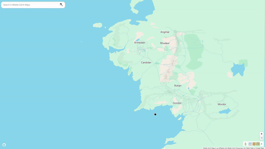

# Middle-Earth Maps

Explore Tolkien's Middle-Earth in an interactive and familiar user-interface based on Google Maps.

Middle-Earth Maps is fully open-source (under the [AGPLv3](./LICENSE)) and can be used online or offline downloading the Android app.

**[Official Website](https://lotr.masterpose.dev/)**

  
  
  

## Contribute

WIP: Currently reestructuring the project.

Still wanna hangout and discuss contributions? [Join our Discord](https://discord.com/invite/DczWDz2dH3).

## Credits & Attributions

- Thanks to [kwoxer/Arda-Maps](https://github.com/kwoxer/Arda-Maps) for the base layer information.
- Thanks to [bburns/arda](https://github.com/bburns/arda) as was my inspiration and first option for the data source, however I ended up using the former.
- Thanks to [Tolkien Gateway](https://tolkiengateway.net/) for the excerpts for each place which I scrapped respectfully throttling the requests.
- Thanks to [Game Icons](https://game-icons.net/) for all the icons used.
- Also thanks to Google Maps designers I guess. I actually [de-Googlefied](https://en.wikipedia.org/wiki/DeGoogle) my life, but Google Maps design is so iconic.
- And of course, thanks to the fellowship of the Ring and the brave warriors and hobbits which fighted against the darkness.
- (And thanks to J.R.R Tolkien for making all of this exist).
